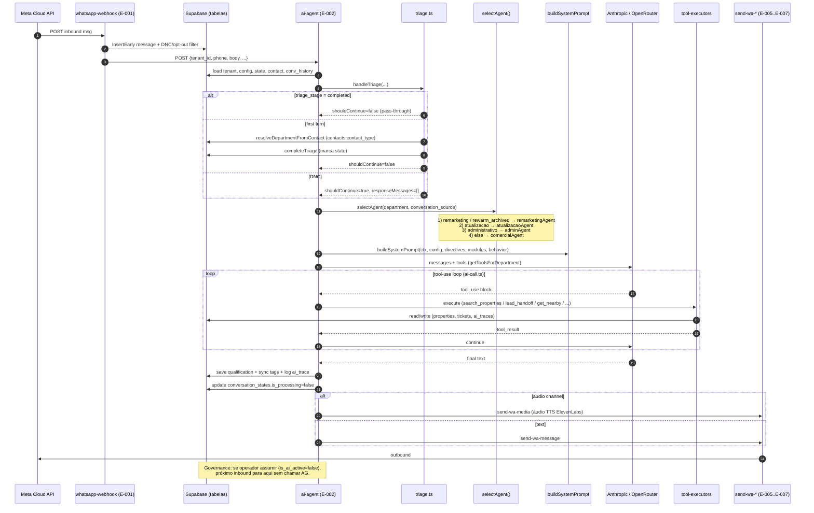
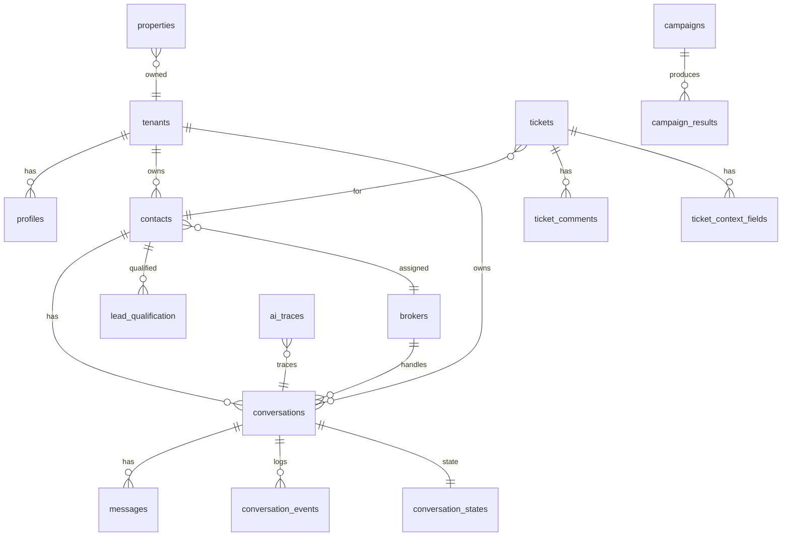

# Mapa Estrutural Aimee — v1.0-parcial (white-box)

## 0. Sumário Executivo

**Métricas (commit df7b437):**
- LOC TS/TSX frontend (`src/`): **43.365** linhas.
- LOC TS Edge Functions (`supabase/functions/`): **19.168** linhas.
- Módulos compartilhados (`_shared/`): 18 arquivos; núcleo de agentes em `_shared/agents/` (7 arquivos, ~4.270 LOC).
- Rotas de UI: **41** (27 app + 13 admin + 1 lab-index, ver §7).
- Edge Functions ativas no projeto Supabase: **43** (ver §8).
- Tabelas `public`: **45** (ver §9).
- Prompt builders identificados: **~22** funções `build*Prompt` distribuídas em 5 arquivos (ver §10).
- Skills no sentido Claude SKILL.md: **nenhuma** no código do produto (as skills sob `.claude/skills/` são do harness BMad de dev, não do agente Aimee em runtime — ver §11).
- Integrações externas: **7** (Anthropic, OpenRouter/Gemini, Meta WhatsApp Cloud, Vista CRM, C2S CRM, ElevenLabs, Google Maps — ver §12).
- Débito autodeclarado (TODO/FIXME/HACK/XXX em src+functions): **4 ocorrências**. Muito baixo — indica código jovem com débito não-verbalizado migrado para memória do time (ver §13).

**5 observações arquiteturais críticas:**

1. **A separação Identity/Memory/Soul/Governance NÃO existe como camadas arquiteturais no código.** A palavra "Identity" aparece 3× — sempre como uma *sub-seção XML dentro do system-prompt* (`comercial.ts:21`, `comercial.ts:198`, `remarketing.ts:601`), não como módulo. "Memory", "Soul", "Governance", "OpenClaw" têm **zero** ocorrências em `src/` e `supabase/functions/`. A arquitetura real é **roteador fino + 4 agentes de domínio paralelos** (ver §4 e drift AIMEE.Q-001).
2. **`ai-agent/index.ts` é um orquestrador monolítico de ~1.3k LOC**, não um roteador fino como o cabeçalho afirma ("Thin router" — `ai-agent/index.ts:2`). Acumula carregamento de contexto, triage, seleção, build de prompt, execução de tools, escrita de trace. Hotspot #1 de churn (61 commits/3mo).
3. **Revisão humana como camada de governança não existe como interceptador formal.** Operador "assumir conversa" pausa a IA via coluna `conversations.is_ai_active`; não há pipeline de aprovação pré-envio. O commit mais recente (df7b437) formaliza "operador assumiu → Aimee pausada até devolução manual" como regra, confirmando que governance é mecanismo de *kill-switch pós-hoc*, não de *review pré-envio*.
4. **A arquitetura efetiva é domain-agent federada por `department`**: `comercial | admin | remarketing | atualizacao`, selecionados deterministicamente em `selectAgent()` (`ai-agent/index.ts:31-60`). Cada agente carrega seu próprio `build*Prompt` + `AgentModule` com `getTools()`. Isso é mais granular que a sugestão Identity/Memory/Soul — porém sem memória explícita de longo prazo por agente (memory = leitura ad-hoc de `contacts` + `lead_qualification` + `conversation_states`).
5. **Feature flag `MULTI_AGENT_ENABLED` default ON** (`ai-agent/index.ts:64`) mas ainda há arquivos/paths "legacy" (`comercial.ts:buildLegacyDirectivePrompt`, `remarketing.ts:buildLegacyRemarketingPrompt`). Código morto candidato se a flag nunca mais volta a false — ver AIMEE.Q-004.

---

## 1. Baseline de Captura

- **Commit:** `df7b437` — *Webhook_NoAutoReactivateAI: operador assumiu, Aimee fica pausada até devolução manual* (2026-04-21 23:35)
- **Branch:** `main`
- **Working tree:** 1 untracked (`docs/casa-lais-mapa-estrutural-v1.0.md` — v1.0 da Lais).

### Árvore de repositório (profundidade 2, filtrada)

```
aimeeia/
├── src/                           # Frontend React+Vite+Tailwind+Shadcn (43k LOC)
│   ├── pages/                     # Rotas: 29 app pages + 11 admin + 7 lab
│   ├── components/                # 14 pastas temáticas (ui, chat, admin, campaigns, ...)
│   ├── hooks/                     # 9 custom hooks
│   ├── lib/                       # 7 utilitários (parsers, lead-tags, access-control)
│   ├── integrations/supabase/     # Client + types.ts auto-gerado
│   └── contexts/                  # React contexts (auth, tenant)
├── supabase/
│   ├── functions/                 # 43 edge functions ativas (19k LOC)
│   │   ├── _shared/               # Núcleo: agents/, prompts.ts, triage.ts, ai-call.ts, ...
│   │   └── [43 subpastas]         # ai-agent, whatsapp-webhook, c2s-*, vista-*, etc.
│   └── migrations/                # 64 migrations
├── docs/                          # 20+ docs (arquitetura, sprints, auditoria, Lais map)
├── directives/                    # Não inspecionado — AIMEE.X-002
├── execution/                     # Não inspecionado — AIMEE.X-003
├── _bmad/ , _bmad-output/         # Harness BMad (fora do produto) — AIMEE.X-001
├── .claude/skills/                # Skills do harness dev, não runtime — AIMEE.X-004
├── .env, .env.local (não versionados)   # Secrets — não inspecionados por policy
├── package.json, vercel.json, vite.config.ts, tsconfig*.json
└── test_xml.cjs, test_xml.ts       # Scripts avulsos no root — AIMEE.Q-005
```

### Atividade recente (últimos 20 commits, autor = Ian)

| SHA | Data | Assunto |
|---|---|---|
| df7b437 | 2026-04-21 | Webhook_NoAutoReactivateAI |
| d1c5dd1 | 2026-04-21 | Webhook_InsertEarly (texto ~1s, áudio ~1s) |
| a13238b | 2026-04-21 | Realtime_CreatePartitions_AutoCron |
| a8723bf | 2026-04-21 | Realtime_AuthorizationPolicies |
| dbea3c8 | 2026-04-21 | Realtime_ReauthWS_Polling15s |
| c7f461a | 2026-04-21 | Realtime_ReplicaFullConvStates |
| 336eedd | 2026-04-21 | Realtime_RemovePolling |
| 87e6110 | 2026-04-21 | Remarketing_RotaRewarmArchived |
| 864217a | 2026-04-21 | Audio_EspelhamentoCanal |
| 5d69e58 | 2026-04-21 | Multilingual_EspelhamentoIdioma |
| 7e8b67f | 2026-04-20 | Realtime_PollingFallback |
| 978a8f5 | 2026-04-20 | Realtime_DiagnoseError |
| 3f893f1 | 2026-04-20 | AudioRecord_FixWhiteScreen (revert) |
| 2f37755 | 2026-04-20 | AtualizacaoSector_Dia1 |
| f4fd468 | 2026-04-20 | Realtime_DebugIndicator |
| 3fef203 | 2026-04-20 | AudioRecord_FixMP3 |
| 6b30ff1 | 2026-04-20 | AudioRecord_LiveRecording |
| f9e9d09 | 2026-04-20 | LocacaoAdmin_TicketAbertoNaoSilenciaIA |
| 3414c31 | 2026-04-20 | LocacaoAdmin_RealtimeAudio |
| 594e73e | 2026-04-20 | LocacaoAdmin_ZeroC2S |

Padrão observado: **refactors em Realtime + áudio + isolamento do setor admin dominam a semana pré-cutover**. Convenção `{Categoria}_{Sessão}` aplicada (feedback_commit_format.md).

---

## 2. Stack Técnica

| Categoria | Tecnologia | Versão | AIMEE.D-### | Papel |
|---|---|---|---|---|
| Framework | React | ^18.3.1 | D-001 | UI runtime |
| Framework | Vite | ^5.4.19 | D-002 | Build + dev server |
| Framework | TypeScript | ^5.8.3 | D-003 | Linguagem |
| LLM/agente | Anthropic SDK (HTTP direct) | — | D-010 | Chamada ao Claude via `fetch` em `ai-call.ts` (sem SDK oficial) |
| LLM/agente | OpenRouter (HTTP direct) | — | D-011 | Gateway p/ Gemini 2.5 Flash (fallback) — ver `feedback_ai_models.md` |
| LLM/agente | ElevenLabs (HTTP direct) | — | D-012 | TTS para mensagens de voz |
| Data | @supabase/supabase-js | ^2.97.0 | D-020 | Client Supabase (frontend + edge) |
| Data | @tanstack/react-query | ^5.83.0 | D-021 | Cache/sync server state |
| Data | zod | ^3.25.76 | D-022 | Runtime schema validation |
| Data | xlsx | ^0.18.5 | D-023 | Import planilha C2S/contatos |
| Data | fast-xml-parser | ^5.4.1 | D-024 | Parse XML catálogo Vista |
| UI | Shadcn (Radix primitives) | múltiplas | D-030 | Design system base |
| UI | Tailwind CSS | ^3.4.17 | D-031 | Styling |
| UI | react-router-dom | ^6.30.1 | D-032 | Routing (SPA) |
| UI | react-hook-form + @hookform/resolvers | ^7.61.1 | D-033 | Forms |
| UI | recharts | ^2.15.4 | D-034 | Charts (dashboard, reports) |
| UI | @dnd-kit/* | ^6.3.1 | D-035 | Kanban drag (Pipeline) |
| UI | lucide-react | ^0.462.0 | D-036 | Ícones |
| UI | sonner | ^1.7.4 | D-037 | Toasts |
| UI | cmdk, vaul, embla, input-otp | várias | D-038 | Primitivas secundárias |
| Infra | Vercel | N/A | D-050 | Deploy frontend SPA |
| Infra | Supabase | N/A | D-051 | DB+Auth+Edge+Realtime+Storage |
| Infra | Deno (runtime edge) | std@0.168.0 | D-052 | Runtime das edge functions |
| Observabilidade | `ai_traces` (tabela) | — | D-060 | 30.715 linhas já gravadas — trace caseiro |
| Observabilidade | `activity_logs` (tabela) | — | D-061 | Audit trail de ações |
| Dev | Vitest | ^3.2.4 | D-070 | Tests (src/test/, `*.test.ts`) |
| Dev | ESLint | ^9.32.0 | D-071 | Lint |
| Dev | lovable-tagger | ^1.1.13 | D-072 | Integração Lovable editor |

**Observação:** nenhum LangChain, nenhuma lib de agents explícita. Tool-use é implementado à mão em `_shared/ai-call.ts` e `_shared/agents/tool-executors.ts`.

---

## 3. Infraestrutura e Deploy

- **Frontend:** Vercel, framework=vite, build `npm run build` → `dist/`, SPA rewrite `/(.*) → /index.html` (`vercel.json`). Detalhes operacionais em `memory/reference_vercel.md`.
- **Banco:** Supabase project `vnysbpnggnplvgkfokin`. 45 tabelas `public`, RLS habilitada em todas.
- **Edge Functions:** 43 ativas, **todas deployed com `--no-verify-jwt`** por regra (ver `feedback_deploy_jwt.md`). Auth interna via `SUPABASE_SERVICE_ROLE_KEY`.
- **CI/CD:** não observado workflow GitHub Actions no root (`ls` não mostrou `.github/`). Deploy manual via `npx supabase functions deploy` + push Vercel. Convenção "deploy + push imediato sem confirmação" é regra de time (`feedback_deploy_push.md`), não automação.

### Variáveis de ambiente esperadas (NOMES APENAS)

Extraídas de `Deno.env.get(...)` e `import.meta.env.*` no código:

- **Frontend (Vite):** `VITE_SUPABASE_URL`, `VITE_SUPABASE_PUBLISHABLE_KEY`.
- **Edge (Supabase/Deno):**
  - Core: `SUPABASE_URL`, `SUPABASE_ANON_KEY`, `SUPABASE_SERVICE_ROLE_KEY`, `ENCRYPTION_KEY`.
  - LLM: `ANTHROPIC_API_KEY`, `GEMINI_API_KEY`, `GOOGLE_AI_API_KEY`, `GOOGLE_API_KEY`, `OPENAI_API_KEY`, `LOVABLE_API_KEY`.
  - Integrações: `ELEVENLABS_API_KEY`, `GOOGLE_MAPS_API_KEY`, `WA_VERIFY_TOKEN`.
  - Feature/config: `MULTI_AGENT_ENABLED`, `ATUALIZACAO_TEMPLATE_NAME`.
- **Débito:** coexistência de `GEMINI_API_KEY` + `GOOGLE_AI_API_KEY` + `GOOGLE_API_KEY` aparenta redundância — ver AIMEE.Q-002.
- **Segredos no código:** nenhum encontrado na varredura padrão; `.env` presente mas não versionado (`.gitignore` cobre). Protocolo de secrets respeitado.

---

## 4. Arquitetura de Camadas (Identity / Memory / Soul / Governance)

**Leitura crítica antes de ler os sub-blocos abaixo:** o briefing desta varredura pressupõe 3 camadas Identity/Memory/Soul + 1 Governance. **Nenhuma dessas camadas existe como módulo no código** (zero ocorrências de "Memory", "Soul", "Governance", "OpenClaw" em `src/` e `supabase/functions/`). A arquitetura real é:

```
WhatsApp webhook → whatsapp-webhook (edge) → ai-agent (edge) {
  triage (deterministic) → selectAgent(department) → buildSystemPrompt
  → callLLMWithToolExecution → tool-executors → send-wa-* (edge) → WA Cloud API
}
```

Abaixo mapeio os 4 IDs previstos na taxonomia contra o que *de fato* existe, marcando cada um como `inferido-por-composicao` se for síntese minha, ou apontando o código que implementa o *análogo funcional*.

### AIMEE.A-01 — Identity (análogo: seção XML `<identidade>` dentro de cada system-prompt)

- **Responsabilidade efetiva:** definir "quem é Aimee" (nome, empresa, tom) no início do system-prompt — **não é uma camada de código**, é um *bloco textual* repetido nos prompts de cada agente de domínio.
- **Localização:** 
  - `supabase/functions/_shared/agents/comercial.ts:21` — "// Identity (XML format consistent with existing prompts)"
  - `supabase/functions/_shared/agents/comercial.ts:198`
  - `supabase/functions/_shared/agents/remarketing.ts:601`
  - Nome do agente + empresa vêm de `ai_agent_config` (tabela) e `tenants.name`, injetados em `buildSystemPrompt` (`prompts.ts:318`).
- **Interface:** string formatada com tags XML injetada no `system` da chamada LLM.
- **Drift:** o briefing assume Identity como camada-de-primeira-classe; no código é *um parágrafo*. Ver AIMEE.Q-001.

### AIMEE.A-02 — Memory (análogo: leitura ad-hoc de tabelas de estado + `ai_traces`)

- **Responsabilidade efetiva:** Aimee "lembra" via:
  1. `conversation_states` (triage_stage, is_processing, last_qualification) — curta duração, por phone.
  2. `lead_qualification` (2 rows — tabela que persiste qualificação extraída, **hoje praticamente vazia**, ver AIMEE.Q-003).
  3. `contacts.crm_*` (8 colunas C2S: neighborhood, price_hint, broker_notes, status, etc.) — contexto histórico do lead.
  4. `conversation_events` + `ai_traces` — log pós-hoc, consumido por analytics, **não realimentado** ao agente em runtime.
  5. `messages` (últimas N lidas via `loadConversationHistory` em `tool-executors.ts:1165`).
- **Localização:** `supabase/functions/_shared/agents/tool-executors.ts` (`loadConversationHistory:1165`, `loadRemarketingContext:1197`), `_shared/qualification.ts`, `_shared/supabase.ts`.
- **Interface:** funções async `load*Context(supabase, tenant_id, phone_number)` → objeto injetado como string num trecho do system-prompt.
- **Drift:** **não há abstração "Memory" unificada**. Cada agente lê tabelas próprias. Não há TTL, nem sumarização de longo prazo, nem embedding store de conversas (embeddings existem mas só para **imóveis**, via `generate-property-embedding`). Ver AIMEE.Q-006.

### AIMEE.A-03 — Soul (análogo: composição `build*Prompt` + `ai_directives` + `ai_modules` + `ai_behavior_config` + `AiModule[]`)

- **Responsabilidade efetiva:** o "comportamento/personalidade/regras" da Aimee é montado em runtime por composição de:
  1. **Directives** (tabela `ai_directives`, 2 rows) — regras globais.
  2. **AI modules** (tabela `ai_modules`, 6 rows) — blocos opcionais ativados por tenant (ex: "humanizar resposta", "anti-loop").
  3. **Department config** (tabela `ai_department_configs`, 0 rows — **tabela existe, vazia**; ver AIMEE.Q-007) — prompt base por dept.
  4. **Behavior config** (tabela `ai_behavior_config`, 1 row) — tom, verbosidade, etc.
  5. **Hardcoded fallback** — strings longas dentro de `build*Prompt` funções (comercial.ts 576 LOC, remarketing.ts 889 LOC, admin.ts 361 LOC, atualizacao.ts 276 LOC).
- **Localização:** `supabase/functions/_shared/prompts.ts` (841 LOC, é a *compositora mãe*), `_shared/agents/{comercial,admin,remarketing,atualizacao}.ts`.
- **Interface:** `buildSystemPrompt(ctx, config, directives, modules, behavior): Promise<string>` em `prompts.ts:318`.
- **Drift:** a camada "Soul" está **real mas difusa** — dividida entre DB (ai_directives, ai_modules) e código (build*Prompt). A prioridade declarada no header `prompts.ts:1-3` é `ai_directives (DB) → ai_department_configs (DB) → hardcoded fallback`, mas como `ai_department_configs` tem 0 rows, na prática **o fallback hardcoded é a fonte de verdade em produção**. Ver AIMEE.Q-007.

### AIMEE.A-04 — Governance (análogo: kill-switch `is_ai_active` + revisão humana via UI operador)

- **Responsabilidade efetiva:** não há *interceptador pré-envio*. Há 3 mecanismos pós-hoc/on-off:
  1. **Kill-switch por conversa:** `conversations.is_ai_active` booleano. Quando operador "assume" no chat (`src/pages/ChatPage.tsx`) a coluna vira `false` e `whatsapp-webhook` ignora novas mensagens inbound para IA (commit `df7b437`).
  2. **DNC guardrail:** `contacts.dnc = true` bloqueia entrada no agente via filtro em `_shared/inbound-filters.ts` (ver `reference_dnc_flag.md`).
  3. **Ticket "aberto" (admin):** a partir de `f9e9d09` NÃO silencia a IA — decisão explícita (correção de `f9e9d09` em `f9e9d09` "LocacaoAdmin_TicketAbertoNaoSilenciaIA").
  4. **Operador manda WhatsApp direto:** `send-wa-message` edge function tem modo "operador" que grava `author_type='operator'` em `messages`.
  5. **ai_error_log** (tabela, 0 rows) — slot reservado, não usado.
- **Localização:** `supabase/functions/whatsapp-webhook/index.ts`, `supabase/functions/_shared/inbound-filters.ts`, `src/pages/ChatPage.tsx`, `src/pages/TicketDetailPage.tsx`.
- **Interface:** flag booleano + filtros de entrada.
- **Drift:** o briefing chama governance de "camada obrigatória". No código, é uma *coleção de flags*, não uma camada. Não há pipeline de aprovação de resposta antes do envio. Não há máscara de PII em `ai_traces` (premissa LGPD do briefing — ver AIMEE.Q-008 CRÍTICO).

### AIMEE.A-05 — Orchestration (é o que mais próximo existe de "camada" real)

- **Responsabilidade:** roteamento, seleção de agente, execução do ciclo tool-use, persistência de trace.
- **Localização:** 
  - `supabase/functions/ai-agent/index.ts` (~1.3k LOC, entry point) — AIMEE.M-01
  - `supabase/functions/_shared/ai-call.ts` (`callLLMWithToolExecution`) — loop de tool-use — AIMEE.M-02
  - `supabase/functions/_shared/agents/agent-interface.ts` (`AgentContext`, `AgentModule`, `AgentType`) — contrato — AIMEE.M-03
  - `supabase/functions/_shared/agents/tool-executors.ts` (1735 LOC) — implementação de todas as tools — AIMEE.M-04
  - `supabase/functions/_shared/triage.ts` — pré-roteamento por `contact_type` — AIMEE.M-05
- **Interface:** POST `/ai-agent` com `{tenant_id, phone_number, message_body, message_type, contact_name, conversation_id, contact_id, raw_message, quoted_message_body}`.

---

## 5. Diagrama de Fluxo (request representativa)



Pontos de decisão relevantes:
- **D1 — triage.ts:32:** `stage === 'dnc' | 'completed' | else`.
- **D2 — ai-agent/index.ts:31:** `selectAgent` (4-way deterministic).
- **D3 — ai-call.ts loop de tool-use:** decisão *do LLM* sobre chamar tool ou finalizar.
- **D4 — tool-executors.ts:768 `executeLeadHandoff`:** transfere lead para corretor humano (handoff).
- **D5 — tool-executors.ts:1096 `executeDepartmentTransfer`:** transferência bidirecional comercial↔admin mid-conversation.

---

## 6. Inventário de Módulos de Código (AIMEE.M-##)

| ID | Módulo | Path | LOC | Camada servida |
|---|---|---|---|---|
| M-01 | Entry orchestrator | `supabase/functions/ai-agent/index.ts` | ~1300 | A-05 |
| M-02 | LLM tool-use loop | `supabase/functions/_shared/ai-call.ts` | — | A-05 |
| M-03 | Agent contract | `supabase/functions/_shared/agents/agent-interface.ts` | 97 | A-05 |
| M-04 | Tool executors | `supabase/functions/_shared/agents/tool-executors.ts` | 1735 | A-02, A-05 |
| M-05 | Triage | `supabase/functions/_shared/triage.ts` | 144 | A-05 |
| M-06 | Prompts composer | `supabase/functions/_shared/prompts.ts` | 841 | A-03 |
| M-07 | Agent comercial | `supabase/functions/_shared/agents/comercial.ts` | 576 | A-03 |
| M-08 | Agent admin | `supabase/functions/_shared/agents/admin.ts` | 361 | A-03 |
| M-09 | Agent remarketing | `supabase/functions/_shared/agents/remarketing.ts` | 889 | A-03 |
| M-10 | Agent atualizacao | `supabase/functions/_shared/agents/atualizacao.ts` | 276 | A-03 |
| M-11 | Pre-completion check | `supabase/functions/_shared/agents/pre-completion-check.ts` | 236 | A-05 |
| M-12 | Qualification extractor | `supabase/functions/_shared/qualification.ts` | 646 | A-02 |
| M-13 | Anti-loop | `supabase/functions/_shared/anti-loop.ts` | — | A-05 |
| M-14 | Analyze (post-hoc) | `supabase/functions/_shared/analyze.ts` | 356 | observabilidade |
| M-15 | Portal link resolver | `supabase/functions/_shared/portal-link-resolver.ts` | — | A-05 |
| M-16 | Property helpers | `supabase/functions/_shared/property.ts` | — | — |
| M-17 | Regions knowledge | `supabase/functions/_shared/regions.ts` | — | A-03 |
| M-18 | WhatsApp helpers | `supabase/functions/_shared/whatsapp.ts` | — | integração |
| M-19 | WhatsApp media | `supabase/functions/_shared/whatsapp-media.ts` | — | integração |
| M-20 | Audio transcription | `supabase/functions/_shared/audio-transcription.ts` | — | integração |
| M-21 | TTS ElevenLabs | `supabase/functions/_shared/tts.ts` | — | integração |
| M-22 | Phone normalizer | `supabase/functions/_shared/phone.ts` | — | util |
| M-23 | Inbound filters (DNC) | `supabase/functions/_shared/inbound-filters.ts` | — | A-04 |
| M-24 | C2S lead mapper | `supabase/functions/_shared/c2s-lead-mapper.ts` | — | integração |
| M-25 | Supabase helpers | `supabase/functions/_shared/supabase.ts` | — | infra |
| M-26 | Types | `supabase/functions/_shared/types.ts` | — | infra |
| M-27 | Utils (fragment/log) | `supabase/functions/_shared/utils.ts` | — | util |
| M-F1 | Access control (front) | `src/lib/access-control.ts` | — | A-04 (front) |
| M-F2 | C2S parser (front) | `src/lib/c2s-observacoes-parser.ts` + `.test.ts` | — | A-02 |
| M-F3 | Lead tags | `src/lib/lead-tags.ts` | — | A-02 |
| M-F4 | Agent constants | `src/lib/agent-constants.ts` | — | A-03 |

---

## 7. Inventário de Rotas de UI (AIMEE.R-##.##)

Evidência: `src/App.tsx:76-131`.

### App (layout autenticado `AppLayout`)

| ID | Path | Componente (arquivo) | Observação |
|---|---|---|---|
| R-01.01 | `/` | `src/pages/DashboardPage.tsx` | index — dashboard operador |
| R-01.02 | `/inbox` | `InboxPage.tsx` | conversas ativas |
| R-01.03 | `/chat/:id` | `ChatPage.tsx` | cockpit conversa (hotspot §13) |
| R-01.04 | `/history/:id` | `HistoryPage.tsx` | histórico fechado |
| R-01.05 | `/leads` | `LeadsPage.tsx` | leads (tabs Todos/Meus) |
| R-01.06 | `/pipeline` | `PipelinePage.tsx` | Kanban 7 colunas |
| R-01.07 | `/followup-arquivados` | `FollowUpArchivedPage.tsx` | funnel arquivados |
| R-01.08 | `/campanhas` | `CampaignsPage.tsx` | remarketing+marketing |
| R-01.09 | `/campanhas/:id` | `CampaignDetailPage.tsx` | — |
| R-01.10 | `/relatorios` | `ReportsPage.tsx` | relatório resultados |
| R-01.11 | `/dashboard-c2s` | `C2SAnalyticsPage.tsx` | espelho C2S |
| R-01.12 | `/empreendimentos` | `DevelopmentsPage.tsx` | — |
| R-01.13 | `/empreendimentos/novo` | `DevelopmentFormPage.tsx` | — |
| R-01.14 | `/empreendimentos/:id/editar` | `DevelopmentFormPage.tsx` | — |
| R-01.15 | `/minha-aimee` | `MinhaAimeePage.tsx` | config agente do tenant |
| R-01.16 | `/acessos` | `AcessosPage.tsx` | usuários+setor+role |
| R-01.17 | `/captacao` | `CaptacaoPage.tsx` | espelho feature Lais |
| R-01.18 | `/atualizacao` | `AtualizacaoPage.tsx` | sprint 6.2 |
| R-01.19 | `/financeiro` | `FinancePage.tsx` | mock (ver §13) |
| R-01.20 | `/chamados` | `TicketsPage.tsx` | setor admin |
| R-01.21 | `/chamados/:id` | `TicketDetailPage.tsx` | cockpit admin |
| R-01.22 | `/dashboard-admin` | `DashboardAdminPage.tsx` | dashboard admin tenant |
| R-01.23 | `/contatos-admin` | `ContatosAdminPage.tsx` | — |
| R-01.24 | `/dnc` | `DNCPage.tsx` | opt-out management |
| R-01.25 | `/modulos` | `ModulosPage.tsx` | on/off ai_modules |
| R-01.26 | `/guia` | `GuiaPage.tsx` | equivalente "Guia da Lais" |
| R-01.27 | `/auth` | `AuthPage.tsx` | pública |
| R-01.28 | `/landing` | `LandingPage.tsx` | pública |
| R-01.29 | `*` | `NotFound.tsx` | — |

### Admin (layout `AdminLayout` / role `super_admin`)

| ID | Path | Componente | Observação |
|---|---|---|---|
| R-02.01 | `/admin` | `AdminDashboardPage.tsx` | index |
| R-02.02 | `/admin/tenants` | `AdminTenantsPage.tsx` | — |
| R-02.03 | `/admin/tenants/:id` | `AdminTenantDetailPage.tsx` | hotspot #15 |
| R-02.04 | `/admin/billing` | `AdminBillingPage.tsx` | mock |
| R-02.05 | `/admin/agents` | `AgentsOverviewPage.tsx` | — |
| R-02.06 | `/admin/agents/settings` | `AgentGlobalSettingsPage.tsx` | — |
| R-02.07 | `/admin/agents/:agentType` | `AgentDetailPage.tsx` | — |
| R-02.08 | `/admin/metrics` | `AdminMetricsPage.tsx` | mock |
| R-02.09 | `/admin/campanhas` | `AdminCampaignsPage.tsx` | — |
| R-02.10 | `/admin/users` | `AdminUsersPage.tsx` | — |
| R-02.11 | `/admin/modulos` | `AdminModulosPage.tsx` | — |
| R-02.12 | `/admin/agent` | Navigate→`/admin/agents` | alias |
| R-02.13 | `/admin/lab` | `LabLayout.tsx` + 6 sub-rotas | AI Lab |

### AI Lab (sub-rotas de `/admin/lab`)

| ID | Path | Componente |
|---|---|---|
| R-03.01 | `/admin/lab` (index) | `LabSimulatorPage.tsx` |
| R-03.02 | `/admin/lab/prompts` | `LabPromptsPage.tsx` |
| R-03.03 | `/admin/lab/agent-config` | `LabAgentConfigPage.tsx` |
| R-03.04 | `/admin/lab/triage` | `LabTriagePage.tsx` |
| R-03.05 | `/admin/lab/real-conversations` | `LabRealConversationsPage.tsx` |
| R-03.06 | `/admin/lab/analysis` | `LabAnalysisPage.tsx` |

**Ausência vs. Lais (retrofit §15):** LAIS.M-04 `/visits` (agendamento de visitas) não tem equivalente. Ver §15.

---

## 8. Inventário de API (AIMEE.E-###)

43 edge functions ativas. Todas `verify_jwt=false`. Payloads extraídos por análise estrutural — detalhes completos por função exigem abertura individual (pendente v1.1).

| ID | Método | Path (slug) | Handler | Camada | Consumidor |
|---|---|---|---|---|---|
| E-001 | POST | `whatsapp-webhook` | `supabase/functions/whatsapp-webhook/index.ts` | A-04, A-05 | Meta Cloud API |
| E-002 | POST | `ai-agent` | `supabase/functions/ai-agent/index.ts:66` | A-05 | E-001 (interno) |
| E-003 | POST | `ai-agent-simulate` | `ai-agent-simulate/index.ts` | dev | R-03.01 |
| E-004 | POST | `ai-agent-smoke-test` | `ai-agent-smoke-test/index.ts` | QA | manual |
| E-005 | POST | `send-wa-message` | `send-wa-message/index.ts` | integração | E-002, UI |
| E-006 | POST | `send-wa-media` | `send-wa-media/index.ts` | integração | E-002, UI |
| E-007 | POST | `send-wa-template` | `send-wa-template/index.ts` | integração | dispatch-campaign |
| E-008 | POST | `ai-agent-analyze` | `ai-agent-analyze/index.ts` | analytics | R-03.06 |
| E-009 | POST | `ai-agent-analyze-batch` | `ai-agent-analyze-batch/index.ts` | analytics | batch job |
| E-010 | POST | `portal-leads-webhook` | `portal-leads-webhook/index.ts` | A-05 | Canal Pro ZAP (deadline 07/05) |
| E-011 | POST | `vista-get-property` | `vista-get-property/index.ts` | integração | E-002 (tool) |
| E-012 | POST | `vista-search-properties` | `vista-search-properties/index.ts` | integração | E-002 |
| E-013 | POST | `vista-update-property` | `vista-update-property/index.ts` | integração | E-010 atualizacao |
| E-014 | POST | `sync-catalog-xml` | `sync-catalog-xml/index.ts` | sync | cron |
| E-015 | POST | `process-xml-queue-item` | `process-xml-queue-item/index.ts` | sync | cron |
| E-016 | POST | `generate-property-embedding` | `generate-property-embedding/index.ts` | memory | E-014 |
| E-017 | POST | `batch-regenerate-embeddings` | `batch-regenerate-embeddings/index.ts` | batch | manual |
| E-018 | POST | `enrich-property-pois` | `enrich-property-pois/index.ts` | sync | cron |
| E-019 | POST | `get-nearby-places` | `get-nearby-places/index.ts` | integração | E-002 (tool) |
| E-020 | POST | `crm-sync-properties` | `crm-sync-properties/index.ts` | sync | cron |
| E-021 | POST | `c2s-test-connection` | `c2s-test-connection/index.ts` | integração | UI admin |
| E-022 | POST | `c2s-create-lead` | `c2s-create-lead/index.ts` | integração | E-002, E-010 |
| E-023 | POST | `c2s-update-lead-status` | `c2s-update-lead-status/index.ts` | integração | E-002 |
| E-024 | POST | `c2s-delta-sync` | `c2s-delta-sync/index.ts` | sync | cron 1min |
| E-025 | POST | `c2s-import-all-leads` | `c2s-import-all-leads/index.ts` | bootstrap | manual |
| E-026 | POST | `c2s-backfill-lead-brokers` | `c2s-backfill-lead-brokers/index.ts` | one-shot | manual |
| E-027 | POST | `c2s-webhook` | `c2s-webhook/index.ts` | integração | C2S |
| E-028 | POST | `c2s-subscribe-webhooks` | `c2s-subscribe-webhooks/index.ts` | setup | manual |
| E-029 | POST | `sync-brokers` | `sync-brokers/index.ts` | sync | cron/manual |
| E-030 | POST | `brokers-create-users` | `brokers-create-users/index.ts` | setup | manual |
| E-031 | POST | `rewarm-archived-leads` | `rewarm-archived-leads/index.ts` | campanha auto | cron |
| E-032 | POST | `follow-up-check` | `follow-up-check/index.ts` | campanha auto | cron |
| E-033 | POST | `manage-team` | `manage-team/index.ts` | admin | R-01.16 |
| E-034 | POST | `manage-templates` | `manage-templates/index.ts` | admin | UI |
| E-035 | POST | `manage-tickets` | `manage-tickets/index.ts` | admin | R-01.20 |
| E-036 | POST | `manage-ai-key` | `manage-ai-key/index.ts` | admin | UI |
| E-037 | POST | `atualizacao-scheduler` | `atualizacao-scheduler/index.ts` | sprint 6.2 | cron |
| E-038 | POST | `classify-adm-properties` | `classify-adm-properties/index.ts` | sprint 6.2 | manual |
| E-039 | POST | `elevenlabs-voices` | `elevenlabs-voices/index.ts` | integração | UI config |
| E-040 | POST | `dispatch-campaign` | `dispatch-campaign/index.ts` | campanha | UI |
| E-041 | POST | `property-followup` | `property-followup/index.ts` | ? | **órfão candidato** — ver AIMEE.Q-009 |
| E-042 | POST | `list-gemini-models` | `list-gemini-models/index.ts` | dev util | — |
| E-043 | — | (removidas) | — | — | — |

**Payload do E-002 (ai-agent)** — extraído de `ai-agent/index.ts:74-85`:
```
{ tenant_id, phone_number, message_body, message_type,
  contact_name, conversation_id, contact_id, raw_message, quoted_message_body }
```

---

## 9. Schema de Dados (AIMEE.T-###)

45 tabelas `public`, RLS habilitada em todas. Lista por tema (via `mcp__supabase__list_tables`). Detalhe coluna-a-coluna pendente v1.1 (seria +10k tokens — fora de escopo v1.0).

### Tenancy & auth
| ID | Tabela | Rows | Obs |
|---|---|---|---|
| T-001 | `tenants` | 1 | Smolka (único tenant ativo) |
| T-002 | `profiles` | 21 | auth linkage, role, department |
| T-003 | `regions` | 5 | knowledge base regional |

### Core conversacional
| ID | Tabela | Rows | Obs |
|---|---|---|---|
| T-010 | `contacts` | 5.924 | + 8 colunas `crm_*` (Sprint 4) + `dnc` + `assigned_broker_id` |
| T-011 | `conversations` | 87 | `is_ai_active` kill-switch (A-04) |
| T-012 | `messages` | 301 | inbound+outbound |
| T-013 | `conversation_states` | 8 | processing lock + triage_stage |
| T-014 | `conversation_stages` | 8 | pipeline stages canônicas |
| T-015 | `conversation_events` | 28 | eventos pontuais |
| T-016 | `conversation_analyses` | 10 | análise batch pós-hoc |

### Qualification & agent config
| ID | Tabela | Rows | Obs |
|---|---|---|---|
| T-020 | `lead_qualification` | 2 | **quase vazia — AIMEE.Q-003** |
| T-021 | `ai_agent_config` | 1 | nome, empresa, voz, prompts |
| T-022 | `ai_department_configs` | **0** | **tabela existe, vazia — AIMEE.Q-007** |
| T-023 | `ai_directives` | 2 | prioridade 1 do prompt stack |
| T-024 | `ai_behavior_config` | 1 | tom, verbosidade |
| T-025 | `ai_modules` | 6 | modular prompt blocks |
| T-026 | `ai_traces` | **30.715** | trace caseiro — D-060 |
| T-027 | `ai_error_log` | 0 | não usado |
| T-028 | `prompt_versions` | 0 | slot não usado |
| T-029 | `simulation_runs` | 0 | Lab |
| T-030 | `simulation_analyses` | 2 | Lab |
| T-031 | `analysis_reports` | 1 | — |

### Imóveis & captação
| ID | Tabela | Rows | Obs |
|---|---|---|---|
| T-040 | `properties` | 2.810 | sincronizado Vista XML |
| T-041 | `developments` | 0 | empreendimentos |
| T-042 | `portal_leads_log` | 1 | Canal Pro |

### Campanhas & CRM integration
| ID | Tabela | Rows | Obs |
|---|---|---|---|
| T-050 | `campaigns` | 3 | marketing+remarketing |
| T-051 | `campaign_results` | 20 | — |
| T-052 | `whatsapp_templates` | 6 | aprovados Meta |
| T-053 | `broker_wa_templates` | 4 | por corretor |
| T-054 | `brokers` | 51 | Vista↔C2S↔Aimee canonical |
| T-055 | `sync_cursors` | 1 | cursor delta C2S |
| T-056 | `c2s_webhook_events` | 2.453 | log de eventos C2S |
| T-057 | `c2s_import_blocklist` | 1 | Sprint 6.2 |
| T-058 | `rewarm_log` | 83 | auto-campaign |

### Tickets (setor admin / locação)
| ID | Tabela | Rows | Obs |
|---|---|---|---|
| T-060 | `tickets` | 8 | — |
| T-061 | `ticket_categories` | 7 | — |
| T-062 | `ticket_stages` | 6 | — |
| T-063 | `ticket_comments` | 24 | — |
| T-064 | `ticket_context_fields` | 11 | dados que operador alimenta p/ IA |

### Atualização (sprint 6.2 — carteira ADM)
| ID | Tabela | Rows | Obs |
|---|---|---|---|
| T-070 | `owner_contacts` | 0 | — |
| T-071 | `owner_update_campaigns` | 0 | — |
| T-072 | `owner_update_results` | 0 | — |
| T-073 | `vista_audit_log` | 0 | — |

### Governance / observabilidade / misc
| ID | Tabela | Rows | Obs |
|---|---|---|---|
| T-080 | `activity_logs` | 95 | audit trail ações |
| T-081 | `system_settings` | 5 | config global |
| T-082 | `demo_requests` | 0 | landing page leads |

**Diagrama ER conciso (core):**


RLS policies detalhadas: migração `add_super_admin_rls_policies` (Sprint 1) cobriu leitura cross-tenant para `super_admin`. Política coluna-a-coluna pendente v1.1.

---

## 10. Catálogo de Prompts (AIMEE.PR-###)

Prompts **não têm arquivo dedicado por versão** — são funções TS que retornam strings compostas. `prompt_versions` (T-028) existe vazia (slot para versionar no DB). Inventário por função builder:

| ID | Camada | Nome (função) | Arquivo:linha | Propósito | Abertura (≤15 palavras) |
|---|---|---|---|---|---|
| PR-001 | A-03 | `buildFirstTurnContext` | `_shared/prompts.ts:16` | Contexto 1º turno (saudação + intent) | `"Injected into the system prompt when conversationHistory is empty so the agent..."` |
| PR-002 | A-02 | `buildContextSummary` | `prompts.ts:57` | Summary anti-loop do que já foi coletado | `"👤 Nome / 📱 Telefone / 📍 Região / 🏠 Tipo / ..."` |
| PR-003 | A-02 | `buildReturningLeadContext` | `prompts.ts:125` | Lead voltando — reconhecer histórico | — |
| PR-004 | A-05 | `getToolsForDepartment` | `prompts.ts:156` | Tool schema por departamento | (retorna array de tool defs) |
| PR-005 | A-03 | `buildSystemPrompt` (master) | `prompts.ts:318` | Composer-mãe | (composição condicional) |
| PR-006 | A-03 | `buildStructuredPrompt` | `prompts.ts:407` | XML-structured prompt | — |
| PR-007 | A-03 | `buildLocacaoPrompt` | `prompts.ts:522` | Departamento locação | — |
| PR-008 | A-03 | `buildVendasPrompt` | `prompts.ts:564` | Departamento vendas | — |
| PR-009 | A-03 | `buildAdminPrompt` (shared) | `prompts.ts:606` | Admin (superseded) | ver PR-017 |
| PR-010 | A-03 | `buildDefaultPrompt` | `prompts.ts:660` | Fallback | — |
| PR-011 | A-03 | `buildBehaviorInstructions` | `prompts.ts:676` | Tom/verbosidade | — |
| PR-012 | A-03 | `buildMultilingualDirective` | `prompts.ts:710` | Espelhamento idioma (5d69e58) | — |
| PR-013 | A-03 | `buildPostHandoffFollowup` | `prompts.ts:743` | Pós-handoff | — |
| PR-014 | A-03 | `buildRemarketingAnamnese` | `prompts.ts:760` | Anamnese remarketing | — |
| PR-015 | A-03 | `buildModularAdminPrompt` | `agents/admin.ts:17` | Admin modular (current) | — |
| PR-016 | A-03 | `buildAudienceSection` | `agents/admin.ts:72` | Audiência (inquilino/proprietário) | — |
| PR-017 | A-03 | `buildTicketStateSection` | `agents/admin.ts:99` | Estado do ticket | `"'TODOS os dados necessários foram preenchidos pela equipe..."` |
| PR-018 | A-03 | `buildAdminPrompt` (agent) | `agents/admin.ts:143` | Admin (principal) | `"7 PRINCÍPIOS DA AIMEE ADMIN (aplique TODOS em cada resposta)"` |
| PR-019 | A-03 | `buildModularPrompt` | `agents/comercial.ts:16` | Comercial modular | — |
| PR-020 | A-03 | `buildComercialPrompt` | `agents/comercial.ts:117` | Comercial base | — |
| PR-021 | A-03 | `buildStructuredComercialPrompt` | `agents/comercial.ts:178` | Comercial estruturado | — |
| PR-022 | A-03 | `buildLegacyDirectivePrompt` | `agents/comercial.ts:293` | **LEGACY — morto candidato** |
| PR-023 | A-03 | `buildAdminTransferRule` | `agents/comercial.ts:447` | Regra transferência admin | — |
| PR-024 | A-03 | `buildModularRemarketingPrompt` | `agents/remarketing.ts:134` | Remarketing modular | — |
| PR-025 | A-03 | `buildRemarketingPrompt` | `agents/remarketing.ts:308` | Remarketing principal | `"Quando buscar_imoveis retornar resultado, os imóveis já terão..."` |
| PR-026 | A-03 | `buildStructuredRemarketingPrompt` | `agents/remarketing.ts:580` | Remarketing estruturado | — |
| PR-027 | A-03 | `buildLegacyRemarketingPrompt` | `agents/remarketing.ts:692` | **LEGACY — morto candidato** |
| PR-028 | A-03 | `buildPropertyContextSection` | `agents/atualizacao.ts:19` | Contexto imóvel (atualizacao) | — |
| PR-029 | A-03 | `buildAtualizacaoPrompt` | `agents/atualizacao.ts:50` | Atualização principal | — |

**Observação:** a coluna "Tamanho (chars/tokens)" e "Última modificação por arquivo" foi omitida para não explodir a tabela — medir por função exige parse AST. Citações completas proibidas por `exclusions`.

---

## 11. Catálogo de Skills (AIMEE.SK-###)

- **Skills no sentido Claude SKILL.md (runtime do produto): nenhuma.**
- **`.claude/skills/`** contém skills do harness BMad para desenvolvimento (ver AIMEE.X-004), não é invocado pelo agente Aimee em runtime.
- **Análogo funcional** = **tools** disponíveis ao LLM via `getToolsForDepartment` (`prompts.ts:156`). Tools implementadas em `tool-executors.ts`:

| ID | Tool | Executor | Departamentos |
|---|---|---|---|
| SK-001 | `buscar_imoveis` / search | `executePropertySearch:205` | comercial, remarketing |
| SK-002 | `get_nearby_places` | `executeGetNearbyPlaces:712` | comercial, remarketing |
| SK-003 | `lead_handoff` | `executeLeadHandoff:768` | comercial, remarketing |
| SK-004 | `create_ticket` | `executeCreateTicket:899` | admin |
| SK-005 | `get_ticket_context` | `executeGetTicketContext:1006` | admin |
| SK-006 | `admin_handoff` | `executeAdminHandoff:1042` | admin |
| SK-007 | `transferir_administrativo` / dept transfer | `executeDepartmentTransfer:1096` | comercial, admin |
| SK-008 | `confirm_availability` | `executeConfirmAvailability:1444` | atualizacao |
| SK-009 | `update_property_value` | `executeUpdatePropertyValue:1483` | atualizacao |

---

## 12. Integrações (AIMEE.I-###)

| ID | Integração | Direção | Auth | Pontos no código | Evidência |
|---|---|---|---|---|---|
| I-001 | Anthropic (Claude) | out | `ANTHROPIC_API_KEY` | `_shared/ai-call.ts` → `https://api.anthropic.com/v1/messages` | grep URL |
| I-002 | OpenRouter / Gemini 2.5 Flash | out | `GEMINI_API_KEY` (fallback) | `_shared/ai-call.ts` → `https://openrouter.ai/api/v1/chat/completions` | grep URL |
| I-003 | Meta WhatsApp Cloud API | bi | `WA_VERIFY_TOKEN` + access token | inbound `whatsapp-webhook`; outbound `send-wa-*` | E-001, E-005..007 |
| I-004 | Vista CRM (XML catálogo + REST) | in+out | token em `tenants.vista_*` | `sync-catalog-xml`, `vista-get-property`, `vista-search-properties`, `vista-update-property` | E-011..014 |
| I-005 | C2S CRM | bi | token por tenant (encrypted) | `c2s-*` (8 funções) + `c2s-webhook` | E-021..028 |
| I-006 | ElevenLabs TTS | out | `ELEVENLABS_API_KEY` | `_shared/tts.ts` + `elevenlabs-voices` | E-039 |
| I-007 | Google Maps (nearby POI) | out | `GOOGLE_MAPS_API_KEY` | `get-nearby-places` + `enrich-property-pois` | E-018, E-019 |

**Portais imobiliários (ZAP/VivaReal/OLX):** entram via Canal Pro como webhook inbound em `portal-leads-webhook` (E-010), **não como integração de saída**. Deadline 07/05 (memória).

**Jetimob:** não implementado (MVP-pending — memória).

---

## 13. Hotspots e Débito Técnico (AIMEE.H-### / AIMEE.Q-###)

### Hotspots de churn (últimos 3 meses, top 15)

| ID | Arquivo | Commits | Hipótese |
|---|---|---|---|
| H-001 | `supabase/functions/ai-agent/index.ts` | 61 | Orquestrador monolítico; absorve toda mudança de comportamento |
| H-002 | `supabase/functions/_shared/agents/tool-executors.ts` | 53 | 1735 LOC; toda nova tool/ajuste de busca cai aqui |
| H-003 | `src/App.tsx` | 35 | Routing central; toda rota nova toca aqui |
| H-004 | `supabase/functions/ai-agent-simulate/index.ts` | 34 | Acompanha H-001 (precisa simular) |
| H-005 | `supabase/functions/_shared/agents/remarketing.ts` | 33 | 889 LOC; feature flag + múltiplos prompts |
| H-006 | `supabase/functions/whatsapp-webhook/index.ts` | 25 | Filtros DNC, InsertEarly, áudio, multilingual |
| H-007 | `supabase/functions/_shared/agents/comercial.ts` | 25 | Análogo a H-005 |
| H-008 | `supabase/functions/_shared/prompts.ts` | 24 | Composer master |
| H-009 | `src/pages/ChatPage.tsx` | 22 | Cockpit WA-like, áudio live, realtime |
| H-010 | `src/integrations/supabase/types.ts` | 20 | Auto-gerado — churn = schema em movimento |
| H-011 | `src/components/AppSidebar.tsx` | 19 | Rotas novas + role gating |
| H-012 | `supabase/functions/ai-agent-analyze/index.ts` | 17 | — |
| H-013 | `supabase/functions/_shared/triage.ts` | 17 | Sprint triage sem botões |
| H-014 | `supabase/functions/_shared/qualification.ts` | 16 | Extração/merge |
| H-015 | `src/pages/admin/AdminTenantDetailPage.tsx` | 15 | Nova aba DNC, Canal Pro, métricas |

### Débito autodeclarado (TODO/FIXME/HACK/XXX)

Apenas 4 ocorrências em src+functions — **muito baixo**, sinalizando débito migrado para memória humana, não código:
1. `src/pages/admin/AdminTenantsPage.tsx:165` — TODO: Implementar criação de tenant
2. 3 outros são "TODOS" dentro de strings de prompt (falsos positivos, não débito)

### Drift & Débito catalogado

| ID | Categoria | Descrição | Evidência | Severidade |
|---|---|---|---|---|
| Q-001 | drift | Camadas Identity/Memory/Soul/Governance **não existem** como módulos; só como seções inline de prompt. Briefing arquitetural ≠ realidade. | `grep -rEn "Identity\|Memory\|Soul\|Governance\|OpenClaw"` = 3 hits, todos inline em `*.ts` | **alta** |
| Q-002 | drift | 3 env vars para Google AI: `GEMINI_API_KEY`, `GOOGLE_AI_API_KEY`, `GOOGLE_API_KEY` | grep env vars | média |
| Q-003 | drift | `lead_qualification` tem apenas 2 rows apesar de 30.7k traces e 5.9k contatos — persistência pode estar quebrada | `list_tables` | **alta** |
| Q-004 | morto candidato | `buildLegacyDirectivePrompt` (`comercial.ts:293`) e `buildLegacyRemarketingPrompt` (`remarketing.ts:692`) — só acessíveis se `MULTI_AGENT_ENABLED=false` | grep usages | média |
| Q-005 | debt | `test_xml.cjs` e `test_xml.ts` no root — scripts avulsos não integrados | `ls` | baixa |
| Q-006 | drift | Não há abstração "memory" unificada. Cada agente lê tabelas ad-hoc. Sem TTL, sem sumarização long-term, sem embedding de conversas. | `_shared/agents/tool-executors.ts:1165,1197` | média |
| Q-007 | drift | `ai_department_configs` tem 0 rows. Prioridade declarada no header de `prompts.ts:1-3` diz DB→fallback, mas fallback hardcoded é a realidade. | `list_tables` + `prompts.ts:1-3` | média |
| Q-008 | **LGPD / governance** | Premissa arquitetural: "PII de leads mascarada em logs, prompts e artefatos". **Não há máscara** em `ai_traces` (30.7k rows contendo mensagens, nomes, telefones). Também não em `activity_logs`. | `list_tables` + ausência de função `maskPII()` em `_shared/utils.ts` (grep) | **crítica** |
| Q-009 | morto candidato | `property-followup` (E-041) tem versão 9, criada 2026-03-10, não referenciada em `_shared/` — órfão candidato | `list_edge_functions` + grep `property-followup` em src/functions | média |
| Q-010 | drift | `prompt_versions` (T-028), `ai_error_log` (T-027), `simulation_runs` (T-029), `demo_requests` (T-082), `owner_*` (T-070..073), `vista_audit_log` (T-073): 7 tabelas com 0 rows. Slot reservado ≠ feature ativa. | `list_tables` | baixa-média |
| Q-011 | drift | `/financeiro`, `/admin/billing`, `/admin/metrics` são mocks (memória) — UI existe sem backend real | memória + code inspection | alta (bloqueia comercialização) |
| Q-012 | debt | 64 migrations, zero arquivo ADR. Decisões arquiteturais só em commit messages + `_bmad-output/` | `ls docs/` e `ls supabase/migrations/` | baixa |
| Q-013 | risco infra | Todas edge functions com `verify_jwt=false` (por regra de time). Guardrail = chamadas só via `SUPABASE_SERVICE_ROLE_KEY` entre edge. Superfície pública ampla — mitigável com rate-limit (ausente, ver memória MVP). | `list_edge_functions` | alta |

### Código morto candidato (amostra)

- `buildLegacyDirectivePrompt`, `buildLegacyRemarketingPrompt` (PR-022, PR-027).
- Edge function `property-followup` (E-041) — AIMEE.Q-009.
- Edge function `list-gemini-models` (E-042) — dev util, nunca em fluxo.
- 7 tabelas com 0 rows (ver Q-010).

---

## 14. Cobertura de Testes e Quality Gates

- **Presença:** `vitest.config.ts`, `src/test/`, `*.test.ts` em `src/lib/c2s-observacoes-parser.test.ts`. Smoke-test server-side em `supabase/functions/ai-agent-smoke-test/` (E-004).
- **Cobertura observada (inferida):** 
  - `src/lib/c2s-observacoes-parser.ts`: 9/9 testes passing (memória Sprint 4).
  - Outras libs em `src/lib/`: sem `*.test.ts`.
  - Edge Functions: zero testes unitários; só smoke-test ponta-a-ponta (E-004) com 3-5 cenários.
- **Gaps críticos:**
  - Camada A-02 (memory analog): `qualification.ts` (646 LOC) sem testes, apesar de Q-003 sinalizar bug de persistência.
  - Camada A-04 (governance): `inbound-filters.ts` (DNC), sem testes.
  - `_shared/prompts.ts` (841 LOC composer mãe): sem testes.
- **Quality gate ativo:** `npm run build` antes de push (ver `feedback_build_before_push.md`) — captura erros de import Rollup que `tsc --noEmit` não pega. **Sem CI que bloqueia merge**; é convenção humana.

---

## 15. Taxonomia Cruzada com Mapa Lais

### Equivalências (AIMEE ↔ LAIS)

| AIMEE | LAIS | Observação |
|---|---|---|
| R-01.01 `/` | LAIS.M-01 `/` (Início) | Dashboard home |
| R-01.03 `/chat/:id` | LAIS.M-02 `/chats` | Cockpit conversas |
| R-01.05 `/leads` | LAIS.M-03 `/leads` | Lista leads |
| R-01.10 `/relatorios` | LAIS.M-05 `/relatorio-v2` | Relatório (Aimee tem `ee6dcab` "equivalente ao da Lais") |
| R-01.12 `/empreendimentos` | LAIS.M-06 `/developments` | — |
| R-01.18 `/atualizacao` | LAIS.M-07 `/owners` | Atualização (Sprint 6.2) |
| R-01.17 `/captacao` | LAIS.M-08 `/notifications?type=lead-property-acquisition` | — |
| R-01.15 `/minha-aimee` | LAIS.M-09 `/configs` | — |
| R-01.19 `/financeiro` | LAIS.M-10 `/finance` | **Aimee mock** — AIMEE.Q-011 |
| R-01.16 `/acessos` | LAIS.M-11 `/user_management` | — |
| R-01.26 `/guia` | LAIS.M-12 `/trainings_page` | — |
| I-003 WhatsApp | (integração implícita Lais) | — |
| A-04 DNC flag | (inferido Lais) | — |

### Exclusivos Aimee

- **Pipeline Kanban 7 colunas** (R-01.06) — Lais não tem equivalente.
- **Campanhas remarketing + marketing** (R-01.08/09) — Lais não tem.
- **C2S Analytics** (R-01.11) espelho do CRM cliente.
- **Tickets / setor admin** (R-01.20/21, T-060..064) — específico para locação administrativa.
- **AI Lab** (R-03.01..06) — simulador, prompts, triage, analysis.
- **DNC page + analytics** (R-01.24) — governance observável.
- **Realtime cockpit** com áudio live, multilingual, TTS (ElevenLabs).
- **Multi-agente federado** (comercial/admin/remarketing/atualizacao).
- **Espelhamento C2S** em tempo real via delta-sync 1min (E-024).

### Exclusivos Lais (backlog para Aimee)

- **LAIS.M-04 `/visits`** (agendamento de visitas) — **nenhum equivalente em Aimee**. Backlog crítico pré-cutover 07/05.
- **Integração Intercom** (I-001 Lais) — Aimee usa canal próprio (chat interno, não widget Intercom de ajuda).
- **Plataforma Bubble.io** (N/A — a Aimee é custom React+Vite, isso é vantagem estrutural, não gap).

Ver `docs/plano_implementacao_aimee.md` e memória "Casa da Lais Comparison" para comparação feature-rica; este mapa foca na *estrutura*.

---

## 16. Áreas Fora do Alcance (AIMEE.X-###)

| ID | Área | Hipótese |
|---|---|---|
| X-001 | `_bmad/`, `_bmad-output/` | Harness BMad de dev (skills, planning). Fora do runtime do produto. |
| X-002 | `directives/` | Pasta não inspecionada (16 files). Hipótese: artefatos docs/planning. Verificar v1.1. |
| X-003 | `execution/` | Pasta não inspecionada (10 files). Idem X-002. |
| X-004 | `.claude/skills/` | Skills BMad do harness Claude Code, não invocadas pelo agente runtime. |
| X-005 | Coluna-a-coluna das 45 tabelas + RLS policies por tabela | Fora de v1.0 por volume; exige `list_tables verbose=true` + migrations read. |
| X-006 | Conteúdo completo de cada prompt (char/token count, diff vs. versão anterior) | Fora por `exclusions` (≤15 palavras). Cabe a ferramenta dedicada de prompt-audit. |
| X-007 | Runtime logs Vercel + Supabase recentes | Não consultados nesta varredura; exige `mcp__supabase__get_logs` por função. |
| X-008 | CI/CD workflows | Não observado `.github/workflows/`; convenção humana de deploy. |
| X-009 | `src/components/**` breakdown por componente | 14 pastas temáticas, inventário componente-a-componente pendente v1.1. |
| X-010 | Edge function payload schemas (in/out detalhados) | Apenas E-002 detalhado; 42 outras pendentes v1.1. |

---

## 17. Pontos de Instabilidade e Recomendações de Próxima Varredura (v1.1)

Prioridade baseada em hotspots + débito + drift + risco:

1. **🔴 AIMEE.Q-008 — PII em `ai_traces` (LGPD).** 30.7k rows sem máscara, premissa arquitetural violada. *Ação v1.1:* auditar colunas, quantificar exposição, propor função `maskPII()` + retro-backfill.
2. **🔴 AIMEE.Q-003 — `lead_qualification` quase vazia.** Possível bug de persistência — o agente extrai mas não salva. *Ação:* ligar trace de `saveQualificationData` → DB (memória Sprint 3 já menciona bug #0 parcialmente corrigido, mas ainda 2 rows).
3. **🔴 AIMEE.Q-001 — Drift Identity/Memory/Soul.** Se a arquitetura é realmente 3 camadas, refatorar; se não é, atualizar briefing arquitetural e docs para refletir "orchestrator + 4 domain agents". Decisão de produto, não técnica.
4. **🟠 AIMEE.H-001 + H-002 — orquestrador monolítico.** `ai-agent/index.ts` (1.3k LOC, 61 commits/3mo) e `tool-executors.ts` (1.7k LOC, 53 commits/3mo) são hotspots extremos. *Ação:* extrair carregamento de contexto, persistência de trace, e tool-dispatch em módulos.
5. **🟠 AIMEE.Q-011 — mocks bloqueando comercialização.** Financeiro + billing + metrics admin mock. Pré-requisito para sair da Smolka.
6. **🟡 AIMEE.Q-004/Q-009 — limpeza de legacy.** Duas funções `buildLegacy*Prompt` + edge `property-followup`. Decidir: manter flag ou deletar.
7. **🟡 AIMEE.Q-013 — verify_jwt=false em 43 funções.** Adicionar rate-limit e validação interna de origem (header/token específico do projeto) como compensação.
8. **🟡 Cobertura de testes em `prompts.ts` e `qualification.ts`.** São o core cognitivo; zero testes.
9. **🟢 v1.1 do mapa deve cobrir:** schema coluna-a-coluna (X-005), payload completo das 43 edge functions (X-010), inventário de componentes React (X-009), inspeção de `directives/` e `execution/` (X-002/003), consulta de logs de runtime (X-007).

---

## Apêndice A — Índice de Arquivos Citados

| Arquivo | Linhas citadas | Seções |
|---|---|---|
| `supabase/functions/ai-agent/index.ts` | 1-120, 31-60, 64, 66, 74-85 | §0, §4, §5, §6 (M-01), §13 (H-001) |
| `supabase/functions/_shared/prompts.ts` | 1-80, 16, 57, 125, 156, 318, 407, 522, 564, 606, 660, 676, 710, 743, 760 | §4, §6 (M-06), §10 |
| `supabase/functions/_shared/agents/comercial.ts` | 21, 198, 16, 117, 178, 293, 447, 470 | §4, §6, §10 |
| `supabase/functions/_shared/agents/admin.ts` | 17, 72, 99, 143, 180, 325 | §6, §10 |
| `supabase/functions/_shared/agents/remarketing.ts` | 134, 308, 470, 563, 580, 601, 692, 800 | §4, §6, §10 |
| `supabase/functions/_shared/agents/atualizacao.ts` | 19, 50, 245 | §6, §10 |
| `supabase/functions/_shared/agents/tool-executors.ts` | 13, 205, 712, 768, 899, 1006, 1042, 1096, 1165, 1197, 1298 | §4, §5, §6, §11 |
| `supabase/functions/_shared/agents/agent-interface.ts` | 7, 10 | §6 |
| `supabase/functions/_shared/triage.ts` | 1-60, 32 | §4, §5, §6 |
| `src/App.tsx` | 76-131 | §7 |
| `package.json` | — | §2 |
| `vercel.json` | — | §3 |
| `src/pages/admin/AdminTenantsPage.tsx` | 165 | §13 |

---

## Apêndice B — Log de Varredura

| Fase | Comandos/Tools | Resultado | Obstáculos |
|---|---|---|---|
| 0 | `git log`, `git rev-parse`, `ls`, `find -type d -maxdepth 3` | baseline ok | — |
| 1 | `cat package.json`, `cat vercel.json`, grep `process.env/Deno.env.get` | deps + env vars extraídos | — |
| 2 | `ls _shared/agents/`, `grep build*Prompt`, read `prompts.ts:1-80`, read `ai-agent/index.ts:1-120`, read `triage.ts:1-60` | mapa de camadas/composição | **Identity/Memory/Soul ausentes** — registrado Q-001 |
| 3 | `mcp__supabase__list_tables`, `list_edge_functions`, `grep Route`, `ls src/pages` | 45 tabelas + 43 functions + 41 rotas | columns/RLS detalhado fica v1.1 |
| 4 | Leitura `ai-agent/index.ts:31-60` (selectAgent) + `triage.ts:18-50` | fluxo mapeado | — |
| 5 | `git log --name-only \| sort \| uniq -c \| sort -rg`, `grep TODO/FIXME/HACK` | hotspots + 4 débitos | débito verbal migrado p/ memória |
| 6 | Redação do artefato + taxonomia cruzada com LAIS v1.0 | — | cruzar feature-a-feature exige Dossiê Helena (não localizado) |

**Completude:** Fases 0-5 completas com evidência direta. Fase 6 parcial: inventário consolidado; taxonomia cruzada baseada apenas no Mapa Lais v1.0 (Dossiê Helena e Análise Comparativa não localizados no repo — compor pendente v1.1).

---

## Apêndice C — Glossário Aimee

- **Aimee.iA** — produto (Greattings Company). Substitui Lais (Lastro) na Smolka e concorre no mercado.
- **Tenant** — imobiliária cliente. Multi-tenant via coluna `tenant_id` + `get_user_tenant_id()` RPC em RLS.
- **Departamento** — `vendas | locacao | administrativo | remarketing | atualizacao`. Roteia para agente via `selectAgent`.
- **Setor Atualização** — gestão ativa da carteira ADM Smolka (proprietários, 1.310 imóveis, Sprint 6.2).
- **Setor Admin** — locação administrativa (tickets: manutenção, pagamento, documentação).
- **Remarketing** — leads ex-C2S ou arquivados; agente tem contexto CRM (`crm_*` cols em contacts) e anamnese.
- **Rewarm archived** — cron diário que traz leads arquivados há N dias de volta ao remarketing (E-031).
- **C2S (Construtor de Vendas)** — CRM do cliente Smolka. Sync delta 1min + webhook + import histórico.
- **Vista CRM** — catálogo de imóveis. Sync XML + REST para get/search/update.
- **Canal Pro ZAP** — portal do Grupo ZAP (formato Casio). Webhook `portal-leads-webhook`. Deadline 07/05.
- **Handoff** — transferência da Aimee para corretor humano. Tool `lead_handoff` / `admin_handoff`.
- **Triage sem botões** — arquitetura Sprint 3: roteamento por `contact_type` + transferência mid-conversa, sem menu de botões no WA.
- **Aimee pausada** — operador assumiu conversa (`is_ai_active=false`); IA não responde até operador devolver manualmente (df7b437).
- **Anamnese** — seção do prompt remarketing que reconhece contato anterior "sutilmente, sem listar de volta".
- **InsertEarly** — estratégia do webhook de gravar mensagem na DB antes de processar o agente, para o frontend renderizar em ~1s (d1c5dd1).
- **AI Lab** — sandbox admin (/admin/lab) para simulação, análise de prompts, replay de conversas.
- **ai_traces** — tabela de observabilidade caseira; 30.7k rows. Atenção LGPD (Q-008).
- **BMad** — metodologia interna de planning; `_bmad/` contém skills e outputs. Fora do runtime.
- **Lovable** — editor visual de frontend; frontend roda lá *e* local.

---

*Fim do Mapa Estrutural Aimee v1.0-parcial. Próxima varredura: v1.1 cobrindo X-001..X-010 e focos priorizados em §17.*
